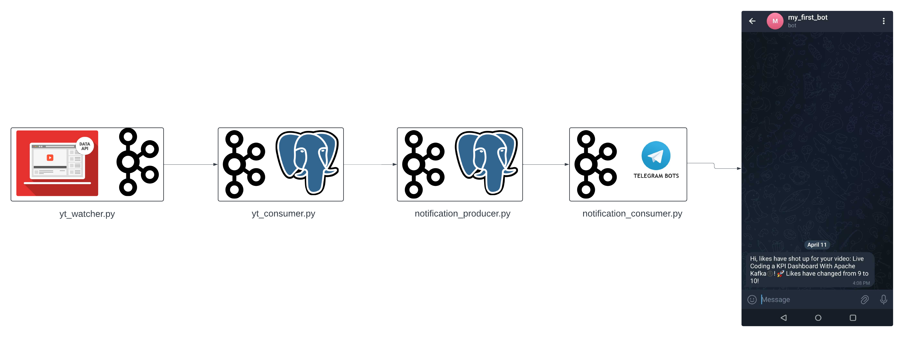

# Youtube Watcher

Utilizing Confluent Kafka, this application delivers real-time notifications on the evolving statistics of YouTube playlists, including metrics such as likes, comments, and views.

## High level program flow

## Overview
- **yt_watcher.py:** Utilizes YouTube data api and Python generators to produce playlist statistics data for the Kafka topic.
- **yt_consumer.py:** Consumes data produced by the kafka topic and saves it in Postgres.
- **notifications_producer.py:** Queries video data from the Postgres table where the latest video statistics are higher than the previously recorded statistics, and produces it to the notification Kafka topic.
- **notifications_consumer.py:** Consumes notification texts and sends notification messages using Telegram POST API to a Telegram bot.

## Setup Telegram bot
1. Search for RawDataBot on Telegram app. Send `/start` message to the bot. It will send you an ID ~i.e. `chat_id`. Save this ID for later use.
2. Search for BotFather on Telegram app. Follow below steps -
    - Send `/start` message to the bot. It will send you a list of commands for your use.
    - Next, send `/newbot` to the bot. Follow the instructions, set the name and username for your new bot.
    - Atlast it will provide you with a token to access the HTTP API, which you need to store for later use.
3. Now you can utilise SendMessage POST API of Telegram to send notifications to the bot.
    
    POST request URL: `https://api.telegram.org/{bot_token}/sendMessage`
    
    `
    form_data: {
        'chat_id': <chat id>,
        'text': <your message>
    }
    `

## Docker set up
- Run `docker-compose up -d` to spin up Kafka and Postgres instances.